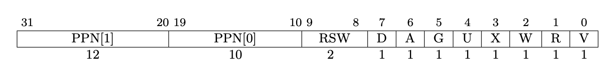

## Lab: Copy-on-Write

- **Target**: implement cow fork to defer allocating and copying physical memory pages until the copies are actually needed.

​	We need a way to record whether a PTE is a COW mapping, use the RSW bits in the RISC-V PTE for this.

- Add `\#define PTE_COW (1L << 8)` in *kernel/riscv.h*

- We should ensure that each physical page is freed when the last **PTE reference** to it goes away. A good way to keep this is a "reference count" of the number of user page tables that refer to that page. Set a page's reference count to one when `kalloc()` allocates it. Increment a page's reference count when fork causes a child to share the page, and decrement a page's count each time any process drops the page from its page table.  `kfree()` should only place a page back on the free list if its reference count is zero.

​	So we can generate an array recording the number of reference count, how big is the array? `(PHYSTOP / PGSIZE)` is the true answear.

- Add `\#define PHYPGNUM (PHYSTOP / PGSIZE)` in *kernel/menlayout.h*, also you can replace `PHYPGNUM` with (`PHYSTOP / PGSIZE`) in the following code.

- Declare the array in *kalloc.c*, and modify `kalloc()` and `kfree` .

  ```
  uint64 refcount[PHYPGNUM];
  
  void *
  kalloc(void)
  {
    struct run *r;
  
    acquire(&kmem.lock);
    r = kmem.freelist;
    if(r){
      kmem.freelist = r->next;
      refcount[(uint64)r / PGSIZE] = 1;//add
    }
    release(&kmem.lock);
  
    if(r)
      memset((char*)r, 5, PGSIZE); // fill with junk
    return (void*)r;
  }
  
  void
  kfree(void *pa)
  {
    struct run *r;
  
    if(((uint64)pa % PGSIZE) != 0 || (char*)pa < end || (uint64)pa >= PHYSTOP)
      panic("kfree");
  
    // Fill with junk to catch dangling refs.
    //add here
    acquire(&kmem.lock);
    refcount[(uint64)pa / PGSIZE]--;
    if(refcount[(uint64)pa / PGSIZE] > 0)//only place a page back on the free list if its reference count is zero.
    {
      release(&kmem.lock);
      return;
    }
    release(&kmem.lock);
    //end add
    memset(pa, 1, PGSIZE);
  
    r = (struct run*)pa;
  
    acquire(&kmem.lock);
    r->next = kmem.freelist;
    kmem.freelist = r;
    release(&kmem.lock);
  }
  ```

​	And we need to notice `kinit()` calls `freerange()`, then `freerange()` calls `kfree()`, we need to free the space successfully in the beginning, we need to allocate every page's reference count to be 1 in order to handled by `kfree()`.

```
void
freerange(void *pa_start, void *pa_end)
{
  char *p;
  p = (char*)PGROUNDUP((uint64)pa_start);
  for(; p + PGSIZE <= (char*)pa_end; p += PGSIZE){
    refcount[(uint64)p / PGSIZE] = 1;//add
    kfree(p);
  }
}
```

- When we `fork()` a process, we need to plus the reference count by 1. We can make a micro defination of the increasment. `refinc()` in *kernel/kalloc.c*

  ```
  void refinc(void* pa){
    if((uint64)pa % PGSIZE != 0 || (uint64)pa >= PHYSTOP)
      panic("refinc");
  
    acquire(&kmem.lock);
    refcount[(uint64)pa / PGSIZE]++;
    release(&kmem.lock);
  }
  ```

​	At now we complete the basic of the lab.

- Then modify `uvmcopy()` in *kernel/vm.c* to map the parent's physical pages into child, instead of a allocating new page. Clear `PTE_W` in the PTEs of both child and parent for pages that have `PTE_W` set.

  ```
  int
  uvmcopy(pagetable_t old, pagetable_t new, uint64 sz)
  {
    pte_t *pte;
    uint64 pa, i;
    uint flags;
    
    for(i = 0; i < sz; i += PGSIZE){
      if((pte = walk(old, i, 0)) == 0)
        panic("uvmcopy: pte should exist");
      if((*pte & PTE_V) == 0)
        panic("uvmcopy: page not present");
      
      pa = PTE2PA(*pte);//get the next page address
      flags = PTE_FLAGS(*pte);
      
      if(flags & PTE_W){
        flags &= ~PTE_W;
        flags |= PTE_COW; //clear PTE_W
      } 
  
      *pte = PA2PTE(pa) | flags;
      
      if(mappages(new, i, PGSIZE, (uint64)pa, flags) != 0){
        //(mem);
        goto err;
      }
      refinc((void*) pa);
    }
    return 0;
  
   err:
    uvmunmap(new, 0, i / PGSIZE, 1);
    return -1;
  }
  ```

Now test the code.

```sh
prompt >make qemu
...
init: starting sh
$ cowtest
usertrap(): unexpected scause 0x000000000000000f pid=3
            sepc=0x00000000000009ee stval=0x0000000000004f98
usertrap(): unexpected scause 0x000000000000000f pid=2
            sepc=0x0000000000000002 stval=0x0000000000004f98
usertrap(): unexpected scause 0x000000000000000f pid=1
            sepc=0x00000000000006e8 stval=0x0000000000003f68
panic: init exiting
$
```

​	It tells us the scause is 0xf


​	It occurs a page fault problem. Modify `usertrap()`(*kernel/trap.c*) to recognize page faults. When a write page-fault occurs on a COW page that was originally writeable, allocate a new page with kalloc(), copy the old page to the new page, and install the new page in the PTE with `PTE_W` set. Pages that were originally read-only (not mapped `PTE_W`, like pages in the text segment) should remain read-only and shared between parent and child; a process that tries to write such a page should be killed.

​	Generate a `cowpagefault` function(*kernel/trap.c*) to handle these problem. Also need to modify `usertrap()` when a page fault happens.

```
int
cowpagefault(pagetable_t pagetable, uint64 va)
{
  if(va >= MAXVA){
    return -1;
  }
  pte_t *pte = walk(pagetable, va, 0);
  if(pte == 0){
    return -1;
  }
  if((*pte & PTE_V) == 0){
    return -1;
  }
  if((*pte & PTE_COW) == 0){
    return -1;
  }
  if((*pte & PTE_U) == 0){
    return -1;
  }
  uint64 flags;
  uint64 pa0, pa1;
  flags = PTE_FLAGS(*pte);
  flags &= ~PTE_COW;
  flags |= PTE_W;
  pa0 = PTE2PA(*pte);
  if((pa1 = (uint64)kalloc()) == 0){
    return -1;
  }
  memmove((void *)pa1, (void *)pa0, PGSIZE);
  kfree((void *)pa0);
  *pte = PA2PTE(pa1) | flags;
  return 0;
}

void
usertrap()
{
...
	syscall();
	//add here
  }else if(r_scause() == 15){
    if(cowpagefault(p->pagetable, r_stval()) != 0){
      setkilled(p);
    }
  //end add
  } else if((which_dev = devintr()) != 0){
}
```

​	Don't forget to declare `int cowpagefault(pagetable_t, uint64);` in *kernel/def.h* in order to be used in *vm.c*.

- At last, modify `copyout()`(*kernel/vm.c*) to use the same scheme as page faults when it encouters a COW page.

  ```
  int
  copyout(pagetable_t pagetable, uint64 dstva, char *src, uint64 len)
  {
    uint64 n, va0, pa0;
  
    while(len > 0){
      va0 = PGROUNDDOWN(dstva);
      if(va0 > MAXVA) return -1;
      //add here
      pte_t *pte = walk(pagetable, va0, 0);
      if(pte == 0) return -1;
      if((*pte & PTE_W) == 0){
        if(cowpagefault(pagetable, va0) != 0)
         return -1;
      }
      //end add
      pa0 = walkaddr(pagetable, va0);
      if(pa0 == 0)
        return -1;
      n = PGSIZE - (dstva - va0);
      if(n > len)
        n = len;
      memmove((void *)(pa0 + (dstva - va0)), src, n);
  
      len -= n;
      src += n;
      dstva = va0 + PGSIZE;
    }
    return 0;
  }
  ```

```sh
prompt >./grade-lab-cow test
..
== Test running cowtest == (5.5s)
== Test usertests == (50.2s)
== Test   usertests: copyin ==
  usertests: copyin: OK
== Test   usertests: copyout ==
  usertests: copyout: OK
== Test   usertests: all tests ==
  usertests: all tests: OK
```

