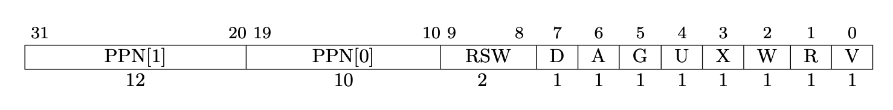

## Lab-page-tables

### Speed up system calls

- **Target**: Implement the optimization for the `getpid()` system call.

Map one read-only page at USYSCALL(a virtual address define in *kernel/memlayout.h*), we need to insert the mapping into page tables.

- Add `struct usyscall *usyscallpage`(defined in *memlayout.h*) to `struct proc` in *kernel/proc.h*. (Every process has a page table mapping to syscall).

- Then we need to initialize the page table in `allocproc()`(*kernel/proc.c:110*). **BE CAREFUL ABOUT THE ORDER**.

  ```
  static struct proc*
  allocproc(void)
  ...
  	if(p->trapframe)...
  //add
  	if((p->usyscallpage = (struct usyscall *)kalloc()) == 0){
      freeproc(p);
      release(&p->lock);
      return 0;
    }
    p->usyscallpage->pid = p->pid;
  //end add
  
  // An empty user page table.
  ...
  ```

- Then we need to do with the permission bits, it's defined in `proc_pagetable()`

  ```
  	if(mappages(pagetable, USYSCALL, PGSIZE,
                (uint64)(p->usyscallpage), PTE_R | PTE_U) < 0){
      uvmfree(pagetable, 0);
      return 0;
    }
  ```

- At last free page in `freeproc()`

  ```
   if(p->trapframe)
      kfree((void*)p->trapframe);
    p->trapframe = 0;
    //add
    if(p->usyscallpage)
      kfree((void*)p->usyscallpage);
    p->usyscallpage = 0;
    //end add
    if(p->pagetable)
      proc_freepagetable(p->pagetable, p->sz);
    p->pagetable = 0;
  ...
  ```

  Pay attention to the function proc_freepagetables, now we need to do a little more to release the USYSCALL pagetable. 

  ```
  void
  proc_freepagetable(pagetable_t pagetable, uint64 sz)
  {
    uvmunmap(pagetable, TRAMPOLINE, 1, 0);
    uvmunmap(pagetable, TRAPFRAME, 1, 0);
    uvmunmap(pagetable, USYSCALL, 1, 0); //add
    uvmfree(pagetable, sz);
  }
  ```

```shh
prompt >./grade-lab-pgtbl ugetpid
make: `kernel/kernel' is up to date.
== Test pgtbltest == (1.3s)
== Test   pgtbltest: ugetpid ==
  pgtbltest: ugetpid: OK
prompt >
```

### Print a page table

- **Target** write a function to print the content of a page table.

​	Write the `vmprint()` function in *kernel/vm.c*, the function `freewalk` (*kernel/vm.c:272*) and `walkaddr`(*kernel/vm.c:109*) may be inspirational.

​	In `walkaddr`, address `uint64 pa` and `pte_t *pte`, and `pa = PTE2PA(*pte)` tells us how to get the address mapped in the page table

​	In `freewalk()` go through the page table and find the leaf.

​	`vmprint()`:

```
void
vmprint(pagetable_t pagetable){
  static int deep = 1;
  if(deep == 1) printf("page table %p\n", pagetable);
  for(int i = 0; i< 512; i++){
    pte_t pte = pagetable[i];
    if(pte & PTE_V){
      for(int j = 1; j < deep; j++){
        printf(".. ");
      }
    }
    if((pte & PTE_V) && (pte & (PTE_R|PTE_W|PTE_X)) == 0){
      printf("..%d: pte %p pa %p\n", i, pte, PTE2PA(pte));
      // this PTE points to a lower-level page table.
      uint64 child = PTE2PA(pte);
      deep++;
      vmprint((pagetable_t)child);
      deep--;
    } else if(pte & PTE_V){
      printf("..%d: pte %p pa %p\n", i, pte, PTE2PA(pte));
    }
  }
}
```

The core of the problem is solved now, next do with dependence.

Define the prototype for vmprint in *kernel/defs.h*

```
//vm.c
void            vmprint(pagetable_t); //add
```

```sh
prompt >./grade-lab-pgtbl printout
...
== Test pte printout == pte printout: OK (1.0s)
    (Old xv6.out.pteprint failure log removed)
prompt >  
```

### Detect which pages have been accessed

- **Target**: Implement `pgaccess()`, a system call that reports which pages have been accessed. Takes three arguments, the virtual address (`va`), the number of page (`sz`), the user address to a buffer to store the bitmask(`user_bitmask_addr`).

- `pgaccess_test()` (*kernel/pgtlbtest.c:52*) tells the upper limit of number of pages is 32.

- The `walk()` (*kernel/vm.c*) help us to find the right PTEs.

- We need allocate the three argument using `argaddr()` and `argint()`;

- The access bit's offset is 6, so we need to assign it in *kernel/riscv.h*.

  ```
  #define PTE_A (1L << 6)
  ```

- `sys_pgaccess` (*kernel/sysproc.c*):

  ```
  int
  sys_pgaccess(void)
  {
    uint64 va; //virtual address
    argaddr(0, &va);
    int sz; //number of page tables
    argint(1, &sz);
    uint64 user_bitmask_addr; //address of a buffer stored bitmask
    argaddr(2, &user_bitmask_addr);
    if(sz > 32)return -1;  //bigger than buffer
    int bitmask = 0; 
    struct proc *p = myproc();
    for(int i = 0; i < sz; i++){
      pte_t *pte = walk(p->pagetable, va, 0);
      if(pte == 0)return -1;
      if((*pte) & PTE_A) //find an accessed page table
      {
        bitmask |= (1 << i); //record the number of page table
      }
      va += PGSIZE;
    }
    if(copyout(p->pagetable, user_bitmask_addr, (char *)&bitmask, sizeof(bitmask)) < 0){
      return -1;
    }
    return 0;
  }
  ```

```sh
prompt >./grade-lab-pgtbl usertest
...
== Test usertests == (66.8s)
== Test   usertests: all tests ==
  usertests: all tests: OK
prompt >
```

