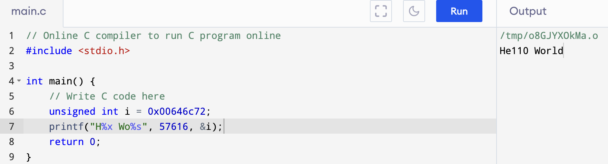

## Lab trap

### RISC-V assembly

​	Learn [MIT 6.191 ISA](https://6191.mit.edu/_static/spring23/resources/references/6191_isa_reference.pdf) ahead.

​	`make fs.img` compiles *user/call.c* and produce a readable assembly version of the program in *user/call.asm*. Read the code in `call.asm` for the function `g`, `f`, and `main`.

Q1.Which registers contain arguments to functions? For example, which register holds 13 in main's call to `printf`?

​	The arguments are restored in `a0, a1, a2` register, and `a2` holds 13.

Q2.Where is the call to function `f` in the assembly code for main? Where is the call to `g`? (Hint: the compiler may inline functions.)

​	In `call.asm:44` explain how `printf` work, and directly pass `f(8)+1` 12 to a2, maybe it's the compiler optimized it. But we can know it's `printf` calls function `f`, function `f` calls `g`.

Q3.At what address is the function `printf` located?

```
  printf("%d %d\n", f(8)+1, 13);
  24:	4635                	li	a2,13
  26:	45b1                	li	a1,12
  28:	00000517          	auipc	a0,0x0
  2c:	7a850513          	add	a0,a0,1960 # 7d0 <malloc+0xe8>
  30:	00000097          	auipc	ra,0x0
  34:	600080e7          	jalr	1536(ra) # 630 <printf>
```

ra at 0x30 when `auipc ra,0x0`, then jalr just add ra 1536(0x600), it's 0x630 now, exactly the address of <printf>.

Q4.What value is in the register `ra` just after the `jalr` to `printf` in `main`?

According to the  [MIT 6.191 ISA](https://6191.mit.edu/_static/spring23/resources/references/6191_isa_reference.pdf) ra = pc + 4, ra = 0x38.

Q5.Run the following code.The output depends on that fact that the RISC-V is little-endian. If the RISC-V were instead big-endian what would you set `i` to in order to yield the same output? Would you need to change `57616` to a different value?



In little-endian, 646c72 will translate to rld, in big-endian, it will be translate to dlr.

and 57616(0xe110) has no need to change.

Q6.In the following code, what is going to be printed after `'y='`? (note: the answer is not a specific value.) Why does this happen?

```
	printf("x=%d y=%d", 3);
```

We get the idea that the arguments were passed through `a1` and `a2`, the code above only pass one argument, but the function will execute with `a1` and `a2`, it will read the value in `a2` even if it is invalid.

### Backtrace

- **Target**: implement `backtrace` function in *kernel/printf.c*.
- The GCC compiler stores the frame pointer of the currently executing function in the register `s0`,`r_fp()` return the value of `s0`.
- You can use `PGROUNDDOWN(fp)` (see *kernel/riscv.h*) to identify the page that a frame pointer refers to.
- See [notes](https://pdos.csail.mit.edu/6.1810/2022/lec/l-riscv.txt) to get the layout of stack frames. The return address lives at a fixed offset (-8) from the frame pointer of a stackframe, and the saved frame pointer lives at fix offset (-16) from the frame pointer.

`backtrace()`:

```
void
backtrace(void){
  uint64 fp = r_fp();
  printf("backtrace:\n");
  while(fp != PGROUNDDOWN(fp)){
    printf("%p\n", *(uint64 *)(fp - 8));
    fp = *(uint64 *)(fp - 16);
  }
  return ;
}
```

​	Then we need to add the prototype to *kernel/defs.h*.

```
void            backtrace(void);
```

​	Add `r_fp()` to *kernel/ricsv.h*

```
// read and write tp, the thread pointer, which xv6 uses to hold
// this core's hartid (core number), the index into cpus[].
...
static inline uint64
r_fp()
{
  uint64 x;
  asm volatile("mv %0, s0" : "=r" (x) );
  return x;
}
```

​	Notice the place to add.

​	Insert `backtrace()` in `sys_sleep()` (*kernel/sysproc.c*)

```
uint64
sys_sleep(void)
{
...
	backtrace();
...
}
```

- Check.

```sh
prompt >./grade-lab-traps backtrace
...
== Test backtrace test == backtrace test: OK (1.2s)
```

### Alarm

- **Target**: periodically alerts a process as it uses CPU time.

​	Add a new `sigalarm(interval, handler)` system call. Is an application calls `sigalarm(n, fn)`, then after every n ticks of CPU time that the program consumes, the kernel should cause application function `fn` to be called. 

#### test0

- Modify the Makefile to cause alarmtest.c

​	Just add `$U/_alarmtest\` as before.

- Put the right declarations in *user/user.h*

  ```
  int sigalarm(int ticks, void (*handler)());
  int sigreturn(void);
  ```

- Update *user/usys.pl*, *kernel/syscall.h*, and *kernel/syscall.c* to allow `alarmtest` to invoke the sigalarm and sigreturn system calls.

  ```
  //add in user/usys.pl
  39 entry("sigalarm");
  40 entry("sigreturn");
  //end add
  
  //add in kernel/syscall.h
  23 #define SYS_sigalarm 22
  244 #define SYS_sigreturn 23
  //end add
  
  //add in kernel/syscall.c
  104 extern uint64 sys_sigalarm(void);
  105 extern uint64 sys_sigreturn(void);
  ...
  131 [SYS_sigalarm] sys_sigalarm,
  132 [SYS_sigreturn] sys_sigreturn,
  //end add
  ```

- **CRUX**: Implement `sys_sigalarm()` and `sys_sigturn()` 

​	`sys_sigalarm()` should store the alarm interval and the pointer to the handler function in new fields in the `proc` structure (*kernel/proc.h*).  Also need to keep track of how many ticks have passed since last call. And initialize `proc` in `allocproc()` in `proc.c`. For now, your `sys_sigreturn` should just return zero.

```
//add in proc.h
struct proc{
...
	int alarm_interval;
  int ticks_pass;
  uint64 alarm_handler;
...
}
//add end

//add in sysproc.c
uint64
sys_sigalarm(void)
{
  int interval;
  uint64 handler;
  argint(0, &interval);
  argaddr(1, &handler);
  struct proc *p = myproc();
  p->alarm_interval = interval;
  p->alarm_handler = handler;
  p->ticks_pass = 0;
  return 0;
}

uint64
sys_sigreturn(void)
{
  return 0;
}
//add end

//add in proc.c: allocproc()
  p->alarm_handler = 0;
  p->alarm_interval = 0;
  p->ticks_pass = 0;
//end add
//Also can add the initialization in freeproc()
	p->alarm_handler = 0;
  p->alarm_interval = 0;
  p->ticks_pass = 0;
//end add
```

- Then we need to modify `usertrap()` so that the user process executes the handler function.

```
if(which_dev == 2){
//add here
    struct proc *p = myproc();
    if(p->alarm_interval && p->alarm_return){
      p->ticks_pass++;
      if(p->ticks_pass == p->alarm_interval){
        p->ticks_pass = 0;
        p->trapframe->epc  = p->alarm_handler; //the crux
      }
    }
//end add
    yield();
  }
  usertrapret();
```

​	**The crux** is when the ticks_pass reach interval, we should modify the epc to handler.

```sh
prompt >./grade-lab-traps test0
...
== Test   alarmtest: test0 ==
  alarmtest: test0: OK
```

#### test1/test2/test3

- **Target**: implement some elements to alarm, when the alarm handler is done, control returns to the instruction at which the user program was originally interrupted by the time interrupt. And store the registers held at the time of the interrupt, os handler is called periodically.

​	On the basic of test0, we just need to do few things to complete it.

- First we need a new field to store enough state in `struct proc` and prevent re-entrant calls to the handler. --if a handler hasn't returned yet, the kernel shouldn't call it again. Make sure to restore a0. `sigreturn` is a system call, and its return value is stored in a0.

  ```
  //add in proc.h
  	struct trapframe save_trapframe;
  	int alarm_return;
  //end add
  //add in proc.c: allocproc()  the same at freeproc()
  	p->alarm_return = 0;
  //end add
  //add in sysproc.c
  uint64
  sys_sigalarm(void)
  {
  ...
    p->alarm_return = 1;
    return 0;
  }
  
  uint64
  sys_sigreturn(void)
  {
  	struct proc *p = myproc();
    *p->trapframe = p->save_trapframe;
    p->alarm_return = 1;
    return p->trapframe->a0;
  }
  ```

- Then we should do with the `trap.c:usertrap()`

  ```
    if(which_dev == 2){
      struct proc *p = myproc();
      if(p->alarm_interval && p->alarm_return){
        p->ticks_pass++;
        if(p->ticks_pass == p->alarm_interval){
          p->save_trapframe = *p->trapframe; //add
          p->ticks_pass = 0;
          p->trapframe->epc  = p->alarm_handler;
          p->alarm_return = 0; //add
        }
      }
      yield();
    }
  ```

```sh
prompt >./grade-lab-traps alarmtest
== Test running alarmtest == (3.9s)
== Test   alarmtest: test0 ==
  alarmtest: test0: OK
== Test   alarmtest: test1 ==
  alarmtest: test1: OK
== Test   alarmtest: test2 ==
  alarmtest: test2: OK
== Test   alarmtest: test3 ==
  alarmtest: test3: OK
prompt >./grade-lab-traps usertests
== Test usertests == usertests: OK (66.6s)
```

