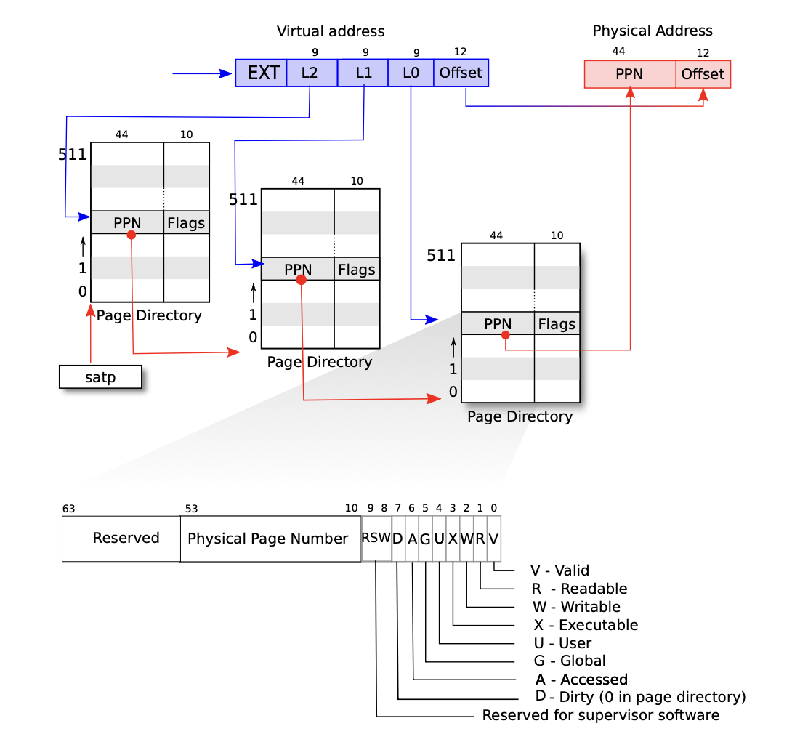

## Chapter 3(Page tables)

Page tables are the most popular mechanism through which the operating system provides each process with its own private address space and memory.

### Paging hardware

- Xv6 runs **Sv39 RISC-V**, which means that only **the bottom 39 bits** of a 64-bit virtual address are **used**, the top 25 bits are not used. A RISC-V page table is logically an array of 2^27^ ***page table entries*** (PTEs). Each PTE contains a **44-bit *physical page number*** (PPN) and some flags. The paging hardware translate a virtual address by using the **top 27 bits** of the 39 bits to **index** into the **page table** to find a **PTE**, and making a 56-bit physcial address whose top **44 bits** come from the **PPN** in the **PTE** and whose bottom **12 bits** are copied from the original virtual address(**offset**).

- As the Figure above shows, translating a virtual address into a physical in three steps.  A page table is stored in physical memory as a three-;evel tree. The root of the tree is a **4096-byte** page-table page that contains **512 PTEs**,  which contains the physical addresses for page-table pages in the next level of the tree. 
- If any of the three PTEs required to translate an address is not present, the paging hardware raises a ***page-fault exception***, leaving it up to the kernel to handle.
- Multi-level page table **saves time and space** but it **costs more to load** PTE.
- To avoid the cost of loading PTEs from physical memory, a RISC-V CPU caches page table entries in a ***Translation Look-aside Buffer*(TLB).**
- The flags and all other page hardware-related structures are defined in (*kernel/riscv.h*)

- The kernel write the physical address of the **root page-table** page into the `stap` register. Each CPU has its own `stap`

### Kernel address space

Xv6 maintains **one page table per process**, describing each process's user address space, plus **a single page table describing the kernel's address space**.

- QEMU simulates a computer that includes RAM starting **at physical address 0x80000000 and continuing throuth at least 0x88000000**, which xv6 callls *PHYSTOP*

- The kernel gets at RAM and memory-mapped device registers using "**direct mapping**".

  There are a couple of kernel virtual addresses that aren't direct-mapped;

  The trampoline page. It is mapped at the top of thevirtual address space.

  The kernel stack pages. The kernel stack is mapped high so that below it xv6 can leave an unmapped guard page (prevent overflow). 

### Code: creating an address spaces

​	Most of the xv6 code for manipulating address spaces and page tables resides in vm.c (*kernel/vm.c:1*), The central data structure is `pagetable_t` which is really a pointer to a RISC-V root page-table page. The central functions are `walk`, whichh **finds the PTE** for a virtual address, and `mappages`, which installs PTEs for **new mappings**. Funtions starting with `kvm` **manipulate the kernel page table**; functions starting with `uvm` manipulate a user page table. `copyout` and `copyin` copy data to and form user vitual addresses provided as system call argumens.

​	In the boot sequnce, `main` calls `kvminit` (*kernel/vm.c:54*) to create the kernel's page table using `kvmmake` (*kernel/vm.c:20*). First allocates a page of physical memory to hold the root page-table page. Then it calls `kvmmap` to install the translations that the kernel needs. `proc_mapstacks` (*kernel/proc.c:33*) allocates a kernel stack for each process. it calls `kvmmap` to map each stack at the virtual address generated by `KSTACK`.

​	`kvmmap`(*kernel/vm.c:132*) calls `mappages`(*kernel/vm.c:143*), which installs **mapping** into a page table for a range of virtual addresses to a corresponding range of physical addresses. For each virtual address to be mapped, `mappages` calls `walk` to find the address of the PTE for that address. It then initializes the PTE to hold the **relevant physical page number**, the desiredd permissions (flag) (*kernel/vm.c:158*).

​	`walk`(*kernel/vm.c:86*) looks up the PTE for a virtual address. Depends on physical memory being directly-mapped into th kernel virtual address space.

​	`main` calls `kvminithart`(*kernel/vm.c:62*) to install the kernel page table. It writes physical address of the root page-table page into the register `satp`.

​	CPU caches page table entries in a TLB, and when xv6 changes a page table, it must tell the CPU to invalidate corresponding cached TLB entries. The RISC-V has an instruction `sfence.vma` that flushes the current CPU's TLB. Xv6 executes `sfence.vma` in `kvminithart` after reloading the `satp` register.

### Physical memory allocation

Xv6 allocates and frees whole 4096-byte pages at a time.

### Code: Physical memory allocator

​	The allocator resides in kalloc.c(*kernel/kalloc.c:1*). The allocator's data structure is a `free list` of physical memory pages. Each free page's list element is a `struct run`(*kernel/kalloc.c:17*). The free page's is protected by a spin lock (*kernel/kalloc.c:21-24*). 

​	The function `main` calls `kinit` to initialize the allocator(*kernel/kalloc.c:27*).

​	The function `kfree`(*kernel/kalloc.c:47*) begins by setting every byte in the memory being freed to value 1.

### Process address space

​	Each process has a separate page table.

- A process's user memory starts at virtual address zero and can grow up the MAXVA(*kernel/riscv.h:360*)
- A process's address space consists of pages (data, stack, heap).

Advantages:

- Different processes's page tables translate user addresses to different pages of physical memory, so that each process has private user memory.
- Each process's sees its memory as having contiguous virtual addresses starting at zero.
- The kernel maps a page with trampoline code at the top of the user address space.

### Code: sbrk

​	`sbrk`  is the system call for a process to shrink or grow its memory. The system call is implemented by the function `growproc`(*kernel/proc.c:260*) `growproc` calls `uvmdealloc`, depending on whether n is positive or negative. `uvmalloc`(*kernel/vm.c:226*) allocates ohysical memory with `kalloc`, and adds PTEs to the user page table with `mappages`. `uvmdealloc` calls `uvmunmap`(kernel/vm.c:171), which uses walk to find PTEs and `kfree` to free the physical memory they refer to.

### Code: exec

​	`exec` is a system call that replaces a process's user address space with data read from a file. `exec`(*kernel/exec.c:23*) opens the named binary `path` using `namei`(*kernel/exec.c:36*). Then, it reads the ELF header. Xv6 binaries are formatted in the widely-used ELF format. `exec` allocates a new page table with no user mappings with `proc_pagetable` (*kerne;/exec.c:49*), allocates memory for each ELF segment with `uvmalloc`, and loads each segemnt into memorry with `loadseg`(*kernel/exec.c:10*). `loadseg` uses `walkaddr` to find the physical address of the allocated memory at which to write each page of the ELF segment, and `readi` to read from the file.