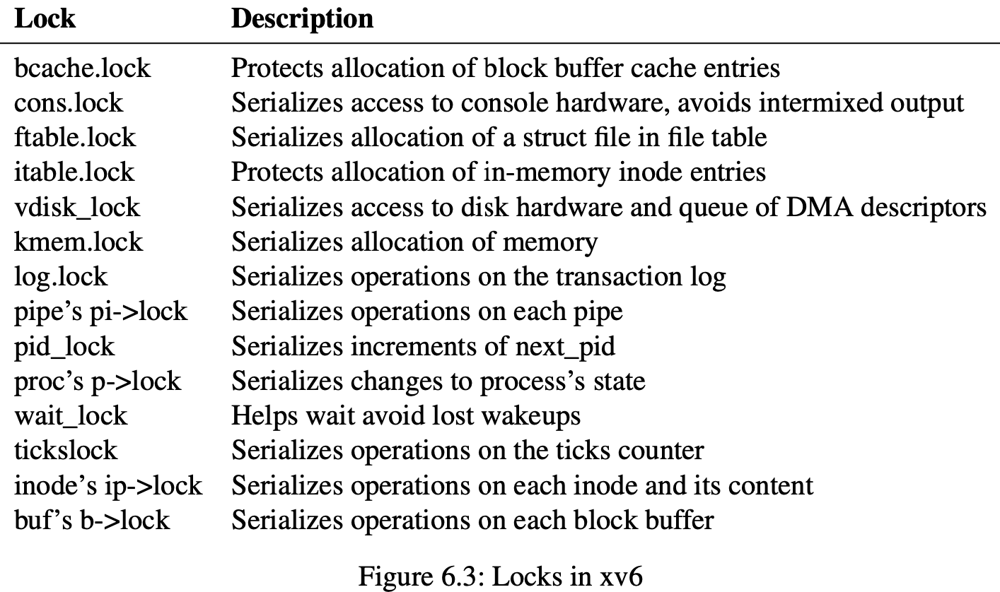

## Chapter 6(lock)

### Races

​	Consider two processes with exited children calling `wait` on two different CPUs, on each CPU, the kernel call `kfree` to free the children's memory page. `kalloc` pops a page of memory from a list of free pages, `kfree` pushes a page to the free list. For best performance, we hope the `kfree`s of the two parent processes execute in parallel, but this would not be correct. 

​	A race is a situation in which a memory location is accessed concurrently. The sequence of instructions between `acquire` and `release` is often called a `critical section`.

### Code: Locks

​	Xv6 has two type of locks: spinlocks and sleep-locks.

##### Spinlock

​	Represent a spinlock as a `struct spinlock`(*kernel/spinlock.h:2*). The important field in the structure is `locked`, a word that is zero when the lock is available and non-zero when it is held.

​	Unfortunately, `acquire` the lock may encouter race when holding the global variable. We need an atomic version to hold the lock, `smoswap r, a.` reads the value at the memory address `a`, write to register `r`.

​	Xv6's `acquire` uses the portable C library call `__sync_lock_test_and_set` which boilsdown to the `amoswap` instruction; the return value is the old contents of `lk->locked`. 

​	The function `release` is the opposite of `acquire` : it clears the `lk->cpu` field and then releases the lock. Conceptually, this operation just assignning zero to `lk->locked` and it can be non-atomic. Xv6 uses C library function `__sync_lock_release` that performs an atomic assignment.

### Code: Using locks

​	A hard part about using locks is deciding how many locks to use and which data and invariants each lock should protect. 

- Any time a variable can be written by one CPU at the same time that another CPU can read or write it.
- If an invariant involves multiple memory locations, typically all of them need to be protected by a single lock.

### Deadlock andl lock ordering

​	It is important that all code paths acquire locks in the same order. Otherwise, there is a risk of *deadlock*.

​	`consoleintr` is the interrupt routine which handles typed characters. When a newline arrives,any process that is waiting for console input should be woken up. To do this, `consoleintr` holds `cons.lock` while calling `wakeup`. 

### Re-entrant locks(recursive locks)

​	If the lock is held by a process and if that process attempts to acquire the lock again, then the kernel could just allow this, instead of calling panic.

### Locks and interrupt handlers

​	Xv6 spinlocks protect data that is used by bboth threads and interrupt handlers. The `clockintr` timer interrupt handler might increment `ticks` at about the same time that a kernel thread reads `ticks` in `sys_sleep`. The lock `tickslock` serialize the two accesses.

​	If a soinlock is used by an interrupt handler, a CPU must never hold that lock with interrupys enabled. For xv6, when a CPU acquires any lock, it always disables interrupts on that CPU. Interrupts may still occur on other CPUs.

​	`acquire` calls `push_off` and `release` calls `pop_off` to track the nesting level of locks. `acquire` call `push_off` strictly before setting `lk->locked`. Simlarly `release` call `pop_off` only after releasing the lock.

### Instruction and memory ordering

​	To tell the hardware and compiler not to re-order, xv6 use `__sync_synchronize()` in both `acquire` and `release`.

### Sleep locks

Xv6 provide locks in the form of *sleep-locks*. `acquiresleep` yields the CPU while waiting. At high level, a sleep-lock has a `locked` field that is protected by a spinlock, and `acquiresleep`'s call to `sleep` atomically yields the CPU and releases the spinlock. The result is that other threads can execute while `acquiresleep` waits.