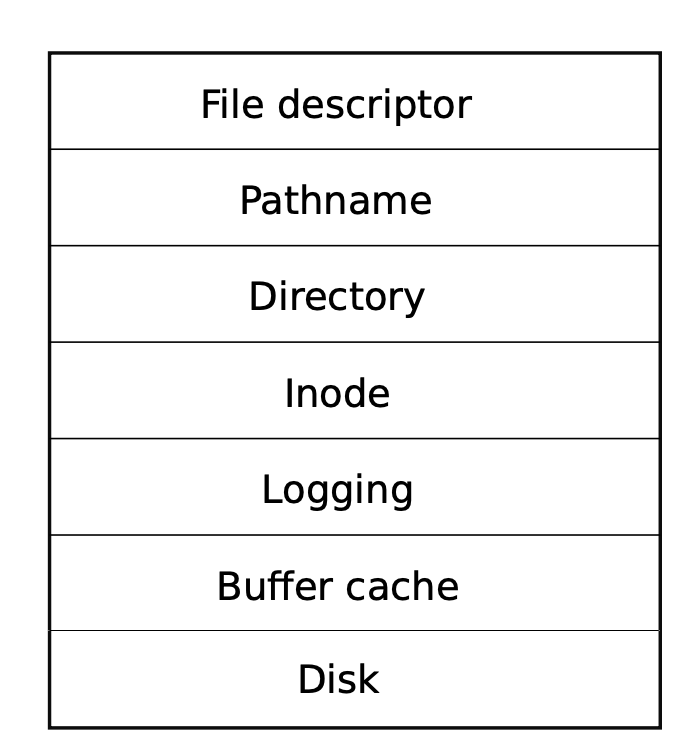
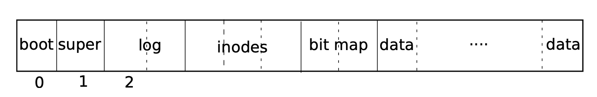
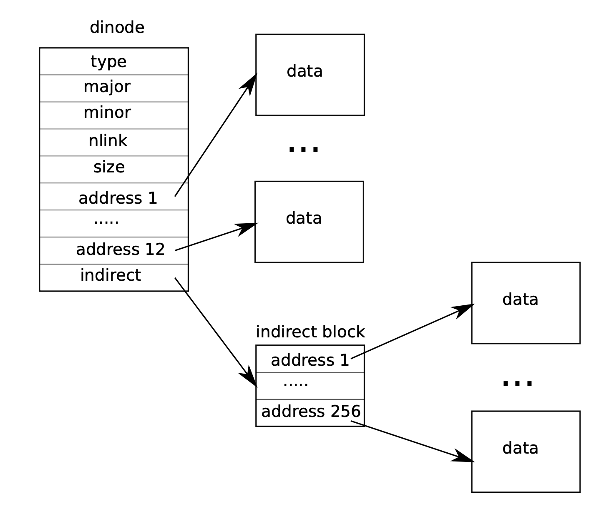

## Chapter 8(File system)

​	The file system addresses several challenges:

- The sile system needs on-disk data structures to represent the tree of named directories and files,.
- The file system must support *crash recovery*.
- Different processes may operate on the file system at the same time.
- File system must maintain an in-memory cache of popular blocks.

### Overview

- The xv6 file system implementation is organized in seven layers. The **disk layer** reads and writes blocks on an virtio hard drive. **The buffer cache layer** caches disk blocks and synchronizes access to them, making sure that only one kernel process at a time can modify the data stored in any particular block. **The logging** layer allows higher layers to wrap updates to several blocks in *transaction*, and ensure that the blocks are updated automatically in the face of crashes. **The inode layer** provides individual files, each represented as an *inode* with a unique i-number and some blocks holding the file's data. **The directory layer** implements each directory as a special kind of inode whose content is a sequence of directory entries, each of which contains a file's name and i-number. **The pathname layer** provides hierarchical path name like `usr/bin/xv6/fs.c`, and resolves them wiith recursive lookup. **The file descriptor layer** abstracts many Unix resources using a file system interface, simplifying the lives of application programmers. 



- The file system must have a plan for where it stores inodes and content blocks on the disk. The file system doesn't use the **block 0**(it holds the boot sector). **Block 1** is called the *superblock*, it contains metadata about the file system (size in blocks, number of data blocks, number of inodes, number of blocks in the log). Blocks starting at **2** hold the **log**. After the log are the **inodes,** with multiple inodes per block. After those come **bitmap** blocks tracking which data blocks are in use. The remain blocks are **data** blocks, each is either marked free in the bitmap, or holds content for a file or directory. The superblock is filled in by a separate program, callled `mkfs`.



### Buffer cache layer

	1) synchronize access to disk blocks to ensure that only one copy of a block is in memory and that only one kernle thread at a time uses that copy
	1) cache popular blocks so that they don't need to be re-read from the slow disk. The code is in *bio.c*.

​	`bread` and `bwrite` obtains a `buf` containing a copy of a block which can be read or modified in memory, and the latter writes a modified buffer to the appropriate block on the disk. A kernel thread must release a buffer by calling `brelse` when it is done with it. The buffer cache uses a per-buffer sleep-lock to ensure that only one thread at a time uses each buffer; `bread` returns a locked buffer, and `brelse` releases the lock.

​	The buffer cache recycles the LRU buffer for the new block.

### Code: buffer cache

​	The buffer cache is a doubly-linked list of buffers. The function `binit` initializes the list with the `NBUF` buffers in the static array buf(*kernel/bio.c:43-52*). All other access to the buffer cache refer to the linked list via `bcache.head` not the `buf`array.

​	`bread` calls `bget` to get a buffer for the given sector.

​	`bget` scans the buffer list for a buffer with the given device and sector numbers. If there is such a buffer, `bget` acquires the sleep-lock for the offer. `bgtt` then returns the lock buffer.

​	If there is no matched buffer, `bget` must make one. Reusing a buffer, looking for a buffer that is not in use (b->refcnt = 0).

### Logging layer

​	Xv6 solve crash recovery with a simple form of logging. An xv6 sytem call does not directly write the on-disk file system data structure. Instead, it places a description of all the disk writes it wishes to **make a *log*** on the disk. Once the system call has **logged all of its writes**, it writes a special ***commit*** record to the disk indicating that the log contains a complete operation. At that point  the system call copies the writes to the on-disk file system data structures. After those writes have completed, the system **call erases the log on disk**.

​	When the system crash and reboot, we should do some operations to *log* before running any processes. If the log is marked as containing a complete operation, then copies the writes to where they belong in the on-disk file system. If the log is not marked, just ignore the log. The recovery code finishes by erasing the log.

### Log design

​	The log resides at superblock. It consists of a header block followed by a sequence of updated block copies. 

​	A typical use of the log:

```
	begin_op();
  ...
  bp = bread(...);
  bp->data[...] = ...;
  log_write(bp);
  ...
  end_op();
```

​	`begin_op` waits until the logging system is not currently commiing, and until there is enough unreserved log space to hold the writes from this call. 

​	`log_write` acts as a proxy for `bwrite`. It records the block's sector number in memory, reserving it a slot in the log on the disk, and pins the buffer in the block cache to prevent the block cache from evicting it.

​	An optimization within `log_write` is called *absorption*. A disk block contains inodes of several files is writen several times within a transaction. By absorbing several disk writes into one, the file system can save log space and can achieve better performance.

​	`end_op` first decrements the count of outstanding system calls. if the count is now zero, it commits the curren transaction by calling `commit()`. `wwrite_log()` copies each block modified in the transaction from the buffer to its slot in the log on disk. `write_head()` writes the header block to disk. `install_trans` reads each block from the log and writes it to the proper place in the file system. Finally `end_op` writes the log header with a  count of zero.

​	`recover_from_log` is called from `initlog`, which is called `fsinit` during boot. It reads the log header annd mimics the action of `end_op` if the indicates that the log contains a committed transaction.

### Inode layer

​	The on-disk inode is defined by a `struct dinode`. The `type` field distinguishes between files, directories, and devices. The `nlink` field counts the number of directory entries that refer to this inode. The `size` field rexords the number of bytes of content in the file. The `addr` array records the block numbers of the disk blocks holding the file's content.

​	The kernel keeps the set of active inodes in memory in a table called `itable`;

​	There are four lock or lock-like mechanism in xv6's inode code. `itable.lock` protects the invariant that an inode is present in the inode table and the invariant that an in-memory inode's `ref` field. Each in-memory inode has a `lock` field containing a sleep-lock, which ensures exclusive access to the inode's fields. Each inode contains a `nlink` field that counts the number of directory entries that refer to a file.

​	A `struct inode` pointer returned by `iget()` is guaranteed to be valid until the corresponding call to `iput()`. `ilock` and `iunlock` locks the inode and read it from the disk.

​	Code that modifies an in-memory inode writes it to disk with `iupdate`.

### Code: Inodes

​	Xv6 calls `ialloc`(similar to `balloc`): loops over the inode structures on the disk, one block at a time, looking for one that is marked free. When it finds one, claim it by writing the new `type` to the disk and then returns an entry form the inode table with the tail call to `iget`.

​	`iget` looks through the inode table for an active entry (ip->ref > 0) with the desired device and inode number. 

​	`iput` release a C pointer to an inode by decrementing the reference count. Id `iput` sees that there are no C pointer refrences to an inode, then the inode must be freed. `iput` calls `itrunc` to truncate the file.

​	`iput` doesn't truncate a file immediately when the lick count for the file drops to zero, which means that over time xv6 runs the risk that it may run out of disk space.

### Code: Inode content

​	The on-disk structure `struct dinode`, contains a size and an array of block numbers. The inode data is found in the blocks listed in the `dinode`'s `addrs` array. The first `NDIRECT` blocks of data are listed in the first `NDIRECT` entries in the array. These blocks are called *direct blocks*. The next `NINDIRECT` blocks of data are listed in a data block called the *indirect block*.



​	The function `bmap` manages the representation so that high-level routines. `bmap` begin by picking off the easy case: the first NDIRECT block are listed in the inode itself, the next NINDIRECT blocks are listed in the indirect block at `ip->addr[NDIRECT]`. `bmap` reads the indirect block and then reads a block number from the right position within the block.

​	`bmap` allocates blocks as needed. An `ip->addrs[]` or indirect entry of zero indicates that no block is allocated.

​	`itrunc` frees a file's blocks, resetting the inode's size to zero.

​	`bmap` makes it easy for `readi` and `writei` to get at an inode's data. `readi`'s  main loop processes each block of the file, copying data from the buffer into `dst`. `writei` loop copies data into the buffers, if the write has extended the file, update its size.

​	`stati` copies inode metadata into `stat` structure, which is exposed to user programs via the `stat` system call.

### Code: directory layer

​	A directory is implemented internally much like a file. Its inode has type `T_dir` . Each entry is a `struct dirent` which contains a name and an inode number.

​	The function `dirlookup` searches a directory for an entry with the given name. 

​	The function `dirlink` writes a new directory entry with the given name and inode number into the directroy `dp`.

### File descriptor layer

​	Each open file is represented by a `struct file`, which is wrapper around either an inode or a pipe.

​	All the open files in the system are kept in a global file table, the `ftable`. 

### Code: system call

​	The function `sys_link` and `sys_unlink` edit directories, creating or removeing references to inodes.